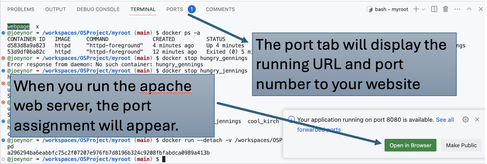
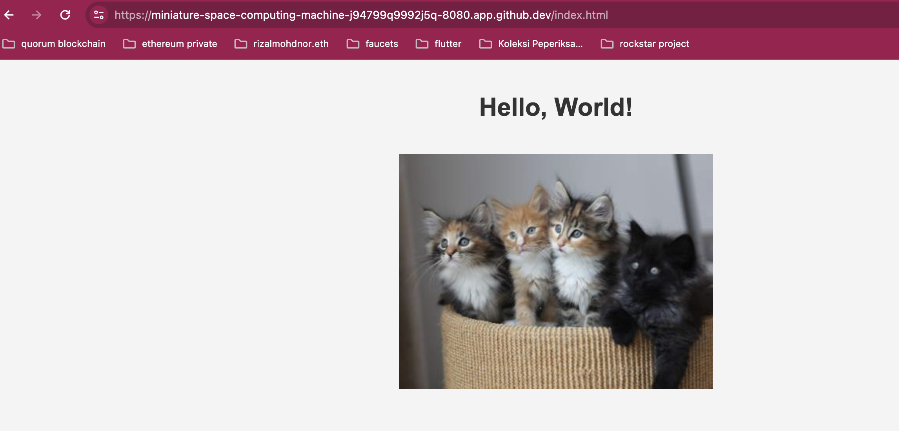

# OSProject
Group Project for OS Section 6
# OSProject Running Containers for Application Development

Group Name: Tom Tom Bak

Section: 6. 

Team Mates:
1. MUHAMMAD AZAMUDDIN BIN SHAHRIL and 2227153
2. IZZUDDIN NURASHEED BIN ABD RASHID and 2226833
3. MUHAMMAD IRFAN ZAFRI BIN MUHAMAD and 2222645


***Questions:***

1. What is the link of the fork OSProject in your repository. 
  https://github.com/zamudun/OSProject
2. How many files and folders are in this repository.  
 1
3. What is default OS used to run the virtual environment for codespaces. 
 Linux
4. What are the two options of ram, disk and vcpu configuration you can have in running codespaces . 
  2 core: 8GB ram 32GB disk. / 4 core: 16GB ram 32GB disk.
5. Why must we commit and sync our current work on source control? 
  To ensure the changes are saved and accessible to different team members.

## Exploring the Terminal

1. Look at the TERMINAL tab. Explore and run commands according to the questions below. 
2. You can include your answers as images, or cut and paste the output here. If you are cutting and pasting your answers, wrap your answers in the codeblock clause in markdown. For example, if i run the command **whoami** the the output would look like the one below.
```bash
@joeynor ➜ /workspaces/OSProject (main) $ whoami 
codespace
```


***Questions:***

Look at the TERMINAL tab. Run the following commands and provide the output here. 

1. Run the command **pwd** . ***(1 mark)*** 
```bash
@zamudun ➜ /workspaces/OSProject (main) $ pwd
/workspaces/OSProject
```

2. Run the command **cat /etc/passwd** . ***(1 mark)*** 
```bash
@zamudun ➜ /workspaces/OSProject (main) $ cat /etc/passwd
root:x:0:0:root:/root:/bin/bash
daemon:x:1:1:daemon:/usr/sbin:/usr/sbin/nologin
bin:x:2:2:bin:/bin:/usr/sbin/nologin
sys:x:3:3:sys:/dev:/usr/sbin/nologin
sync:x:4:65534:sync:/bin:/bin/sync
games:x:5:60:games:/usr/games:/usr/sbin/nologin
man:x:6:12:man:/var/cache/man:/usr/sbin/nologin
lp:x:7:7:lp:/var/spool/lpd:/usr/sbin/nologin
mail:x:8:8:mail:/var/mail:/usr/sbin/nologin
news:x:9:9:news:/var/spool/news:/usr/sbin/nologin
uucp:x:10:10:uucp:/var/spool/uucp:/usr/sbin/nologin
proxy:x:13:13:proxy:/bin:/usr/sbin/nologin
www-data:x:33:33:www-data:/var/www:/usr/sbin/nologin
backup:x:34:34:backup:/var/backups:/usr/sbin/nologin
list:x:38:38:Mailing List Manager:/var/list:/usr/sbin/nologin
irc:x:39:39:ircd:/var/run/ircd:/usr/sbin/nologin
gnats:x:41:41:Gnats Bug-Reporting System (admin):/var/lib/gnats:/usr/sbin/nologin
nobody:x:65534:65534:nobody:/nonexistent:/usr/sbin/nologin
_apt:x:100:65534::/nonexistent:/usr/sbin/nologin
systemd-timesync:x:101:101:systemd Time Synchronization,,,:/run/systemd:/usr/sbin/nologin
systemd-network:x:102:103:systemd Network Management,,,:/run/systemd:/usr/sbin/nologin
systemd-resolve:x:103:104:systemd Resolver,,,:/run/systemd:/usr/sbin/nologin
messagebus:x:104:105::/nonexistent:/usr/sbin/nologin
codespace:x:1000:1000::/home/codespace:/bin/bash
sshd:x:105:65534::/run/sshd:/usr/sbin/nologin
```

3. Run the command **df** . ***(1 mark)*** __Fill answer here__.
4. Run the command **du** . ***(1 mark)*** __Fill answer here__.
5. Run the command **ls** . ***(1 mark)*** __Fill answer here__.
6. Run the command **ls -asl** . ***(1 mark)*** __Fill answer here__.
7. Run the command **free -h** . ***(1 mark)*** __Fill answer here__.
8. Run the command **cat /proc/cpuinfo** . ***(1 mark)*** __Fill answer here__.
9. Run the command **top** and type **q** to quit. ***(1 mark)*** __Fill answer here__.
10. Run the command **uname -a**. ***(1 mark)*** __Fill answer here__.
11. What is the available free memory in the system. ***(1 mark)*** __Fill answer here__.
12. What is the available disk space mounted on /workspace. ***(1 mark)*** __Fill answer here__.
13. Name the version and hardware architecture of the linux Virtual environment. ***(1 mark)*** __Fill answer here__.
14. What is the difference between **ls** vs **ls -asl**. ***(1 mark)*** __Fill answer here__.
15. What is the TLB size of the Virtual CPU. ***(1 mark)*** __Fill answer here__.
16. What is the CPU speed of the Virtual CPU. ***(1 mark)*** __Fill answer here__.
17. What is the top running process that consumes the most CPU cycles. ***(1 mark)*** __Fill answer here__.

## Running your own container instance.

1. At the terminal, run a linux instance. By typing the following command. 
```
docker pull debian
docker run --detach -it debian
```
2. This will run the debian container. To check if the debian container is running, type
```bash
@joeynor ➜ /workspaces/OSProject (main) $ docker ps -a
CONTAINER ID   IMAGE     COMMAND   CREATED         STATUS         PORTS     NAMES
f65be1987f84   debian    "bash"    4 minutes ago   Up 4 minutes             romantic_jackson
```

3. Keep note of the name used by your container, this is usually given random names unless you specify your own name. Now run a bash command on the container. Make sure you use the name of your container instead of the one shown here. 
```bash
docker exec -i -t romantic_jackson /bin/bash
```

4. Create a file on the container. First you must make sure you are in the bash command prompt of the container. The container is new, and does not have any software other than the debian OS. To create a new file, you will need an editor installed. In the bash shell of the container, run the package manager apt-get to install nano text editor. 

```bash
root@f65be1987f84:~# apt-get update      

root@f65be1987f84:~# apt-get install nano

root@f65be1987f84:~# cd /root

root@f65be1987f84:~# nano helloworld.txt
```

5. Edit your helloworld.txt, create your messsage and save by typing ctrl-X. Once saved, explore using the container to see where the file is located. Then exit the shell, by typing **exit**.

6. Stop the container and run **docker ps -a**, and restart the container again. Is your file in the container still available?
```bash 
@joeynor ➜ /workspaces/OSProject (main) $ docker stop romantic_jackson

@joeynor ➜ /workspaces/OSProject (main) $ docker ps -a
CONTAINER ID   IMAGE     COMMAND   CREATED          STATUS                        PORTS     NAMES
f65be1987f84   debian    "bash"    19 minutes ago   Exited (137) 18 seconds ago             romantic_jackson

@joeynor ➜ /workspaces/OSProject (main) $ docker restart romantic_jackson
```

7. Stop the container and delete the container. What happened to your helloworld.txt?

```bash 
@joeynor ➜ /workspaces/OSProject (main) $ docker stop romantic_jackson

@joeynor ➜ /workspaces/OSProject (main) $ docker ps -a
CONTAINER ID   IMAGE     COMMAND   CREATED          STATUS                        PORTS     NAMES
f65be1987f84   debian    "bash"    19 minutes ago   Exited (137) 18 seconds ago             romantic_jackson

@joeynor ➜ /workspaces/OSProject (main) $ docker rm romantic_jackson
```

***Questions:***

1. Are files in the container persistent. Why not?. ***(1 mark)*** __Fill answer here__.
2. Can we run two, or three instances of debian linux? . ***(1 mark)*** __Fill answer here__.

## Running your own container with persistent storage

1. In the previous experiment, you might have notice that containers are not persistent. To make storage persistent, you will need to mount them. 
At the terminal, create a new directory called **myroot**, and run a instance of debian linux and mount myroot to the container. Find out the exact path of my root, and mount it as the root folder in the debian container. 
2. Create a file in /root on the container, the files should also appear in myroot of your host VM.

```bash 
@joeynor ➜ /workspaces/OSProject (main) $ mkdir myroot
@joeynor ➜ /workspaces/OSProject (main) $ cd myroot/
@joeynor ➜ /workspaces/OSProject/myroot (main) $ pwd
/workspaces/OSProject/myroot

@joeynor ➜ /workspaces/OSProject/myroot (main) $ docker run --detach -it -v /workspaces/OSProject/myroot:/root debian
```

***Questions:***

1. Check the permission of the files created in myroot, what user and group is the files created in docker container on the host virtual machine? . ***(2 mark)*** __Fill answer here__.
2. Can you change the permission of the files to user codespace.  You will need this to be able to commit and get points for this question. ***(2 mark)***
```bash
//use sudo and chown
sudo chown -R codespace:codespace myroot

```
*** __Fill answer here__.***

## You are on your own, create your own static webpage

1. Create a directory called webpage in your host machine
2. Inside the directory, create a page index.html, with any content you would like
3. Then, run the apache webserver and mount the webpage directory to it. Hint:
```bash
## the -p 8080:80 flag points the host port 8080 to the container port 80

docker run --detach -v /workspaces/OSProject/webpage:/usr/local/apache2/htdocs/ -p 8080:80 httpd
```

4. If it works, codespace will trigger a port assignment and provide a URL for you to access your webpage like the one below.

 


5. You can also see the Port in the **PORTS** tab, next to the terminal tab.

6. You can then access your website by adding an index.html towards the end of your url link, like the one below. 

 

***Questions:***

1. What is the permission of folder /usr/local/apache/htdocs and what user and group owns the folder? . ***(2 mark)*** __Fill answer here__.
2. What port is the apache web server running. ***(1 mark)*** __Fill answer here__.
3. What port is open for http protocol on the host machine? ***(1 mark)*** __Fill answer here__.

## Create SUB Networks

1. In docker, you can create your own private networks where you can run multiple services, in this part, we will create two networks, one called bluenet and the other is rednet
2. Run the docker create network to create you networks like the ones below
```bash
## STEP 1:
## Create Networks ##
docker network create bluenet
docker network create rednet`

## STEP 2: (automatically running)
## Create (1) Container in background called "c1" running busybox image ##
docker run -itd --net bluenet --name c1 busybox sh
docker run -itd --net rednet --name c2 busybox sh
```
***Questions:***

1. Describe what is busybox and what is command switch **--name** is for? . ***(2 mark)*** __Fill answer here__.
2. Explore the network using the command ```docker network ls```, show the output of your terminal. ***(1 mark)*** __Fill answer here__.
3. Using ```docker inspect c1``` and ```docker inspect c2``` inscpect the two network. What is the gateway of bluenet and rednet.? ***(1 mark)*** __Fill answer here__.
4. What is the network address for the running container c1 and c2? ***(1 mark)*** __Fill answer here__.
5. Using the command ```docker exec c1 ping c2```, which basically tries to do a ping from container c1 to c2. Are you able to ping? Show your output . ***(1 mark)*** __Fill answer here__.

## Bridging two SUB Networks
1. Let's try this again by creating a network to bridge the two containers in the two subnetworks
```
docker network create bridgenet
docker network connect bridgenet c1
docker network connect bridgenet c2
docker exec c1 ping c2
```
***Questions:***

1. Are you able to ping? Show your output . ***(1 mark)*** __Fill answer here__.
2. What is different from the previous ping in the section above? ***(1 mark)*** __Fill answer here__.

## Intermediate Level (10 marks bonus)

### Node.js and MySQL in Docker Containers

This guide will help you set up a simple Node.js website that retrieves a random row from a MySQL database. Both the MySQL server and the Node.js server will run in separate Docker containers on two separate networks. Your job is to make it work by making the two containers in two separate network bridged together.

#### Step 1: Set Up the Docker Network

Create a Docker network to for the two containers.
For mysql, call it **mysqlnet** for nodejs call it **nodejsnet** .

#### Step 2: Set Up the MySQL Container

Run a MySQL container on the created network.

```sh
docker run --name mysql-container --network mysqlnet -e MYSQL_ROOT_PASSWORD=rootpassword -e MYSQL_DATABASE=mydatabase -e MYSQL_USER=myuser -e MYSQL_PASSWORD=mypassword -d mysql:latest
```

#### Step 3: Set Up the Node.js Container

1. **Create a directory for your Node.js application and initialize it.**

    ```sh
    mkdir nodejs-app
    cd nodejs-app
    npm init -y
    npm install express mysql
    ```

2. **Create a file named `index.js` with the following content:**

    ```js
    const express = require('express');
    const mysql = require('mysql');

    const app = express();
    const port = 3000;

    // Create a MySQL connection
    const connection = mysql.createConnection({
      host: 'mysql-container',
      user: 'myuser',
      password: 'mypassword',
      database: 'mydatabase'
    });

    // Connect to MySQL
    connection.connect((err) => {
      if (err) {
        console.error('Error connecting to MySQL:', err);
        return;
      }
      console.log('Connected to MySQL');
    });

    // Define a route to get a random row
    app.get('/random', (req, res) => {
      const query = 'SELECT * FROM mytable ORDER BY RAND() LIMIT 1';
      connection.query(query, (err, results) => {
        if (err) {
          console.error('Error executing query:', err);
          res.status(500).send('Server Error');
          return;
        }
        res.json(results[0]);
      });
    });

    // Start the server
    app.listen(port, () => {
      console.log(`Server running at http://localhost:${port}`);
    });
    ```

3. **Create a Dockerfile for the Node.js application:**

    ```Dockerfile
    # Use the official Node.js image
    FROM node:14

    # Create and change to the app directory
    WORKDIR /usr/src/app

    # Copy application dependency manifests to the container image
    COPY package*.json ./

    # Install production dependencies
    RUN npm install

    # Copy local code to the container image
    COPY . .

    # Run the web service on container startup
    CMD [ "node", "index.js" ]
    ```

#### Step 4: Build and Run the Node.js Container

1. **Build the Docker image for the Node.js application.**

    ```sh
    docker build -t nodejs-app .
    ```

2. **Run the Node.js container on the same network as the MySQL container.**

    ```sh
    docker run --name nodejs-container --network nodejsnet -p 3000:3000 -d nodejs-app
    ```

#### Step 5: Test the Setup

You can now test the setup by accessing the Node.js application in your browser or using a tool like `curl`:

```sh
curl http://localhost:3000/random
```

#### Step 6: Ensure `mytable` is Populated

Make sure you have created the `mytable` table and populated it with some data in your MySQL database for the above steps to work correctly.

You can use the following SQL commands to create and populate the table (run these commands in the MySQL container):

```sql
CREATE TABLE mytable (
  id INT AUTO_INCREMENT PRIMARY KEY,
  name VARCHAR(255) NOT NULL,
  value VARCHAR(255) NOT NULL
);

INSERT INTO mytable (name, value) VALUES ('example1', 'value1'), ('example2', 'value2'), ('example3', 'value3');
```

### Summary

You have now set up a Node.js application in a Docker container on nodejsnet netowrk and a MySQL database in another Docker container on mysqlnet network. Now bridge the two network together.

***Questions:***

1. What is the output of step 5 above, explain the error? ***(1 mark)*** __Fill answer here__.
2. Show the instruction needed to make this work. ***(1 mark)*** __Fill answer here__.


## What to submit

1. Make sure to commit all changes on your source control, and make sure your source control is sync to the repository. 
2. Check your repository link, to see if all the files and answers are included in the repository. 
3. Submit through italeem, by providing the link to your repository.
4. Due by ***AS STATED IN ITALEEM SYSTEM***
